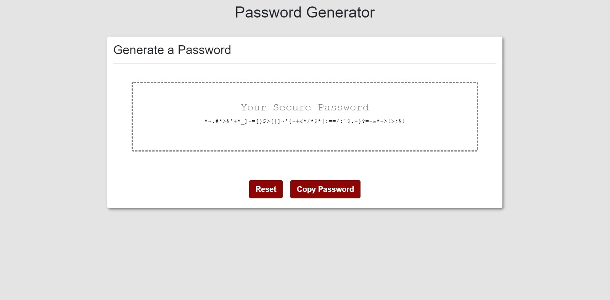

# password-generator-3
## Homework Assignment #3: JavaScript Password Generator

### Goal:

To create a web application that randomly generates a password based on user inputs, mainly using JavaScript.

[Link to Deployed Website](https://gafelton.github.io/password-generator-3/)

### Details:

* Layout uses responsive Bootstrap elements.
* The Generate Password button will ask for user preference on length (8-128), uppercase, lowercase, numbers, and special characters. Based on these criteria, the application will then generate a password and display it in the center of the page.
* The user then has the option to reset the page in order to create another password, or to copy the current password to the clipboard.
* The webpage itself is not secure, but the passwords generated would be difficult to crack. I track in the console how many possible combinations *could* have been generated based on the user's parameters.
